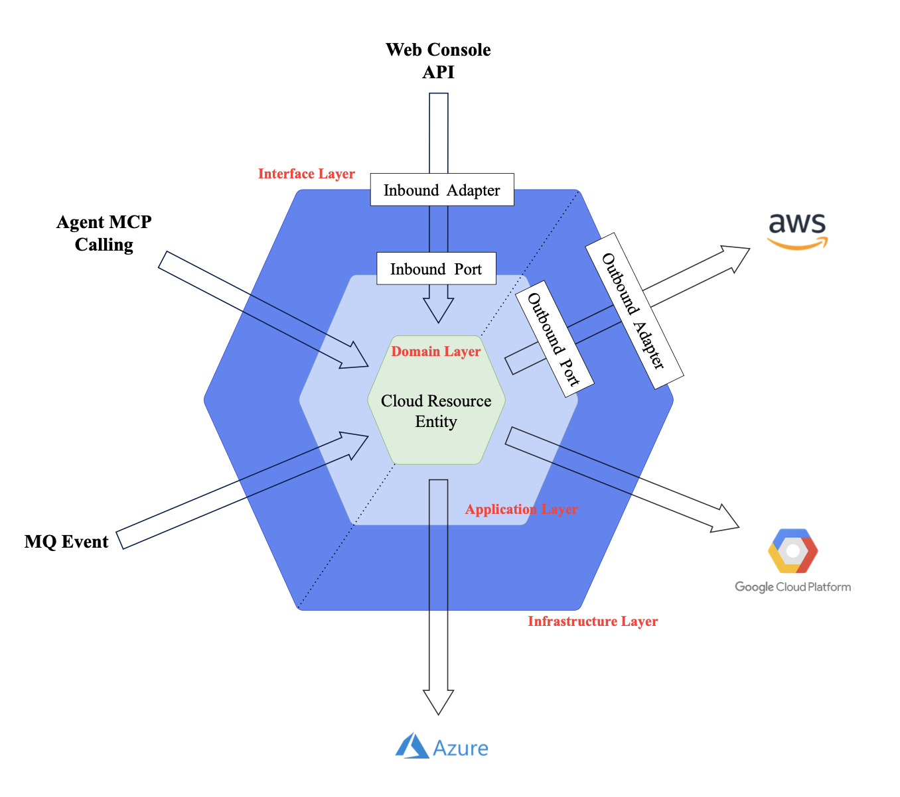

## 그림으로 보는 헥사고날 아키텍처

---

## TL;DR
- 다양한 외부 요청(Web, Agent)의 유연한 수용과 특정 클라우드 서비스에의 종속성 제거를 위해 포트와 어댑터 패턴으로 내·외부를 철저히 격리하는 아키텍처

---

## 개념 정의

비즈니스 로직(Core)을 중심으로, **들어오는 요청(Inbound)**과 **나가는 기술(Outbound)**을 모두 **포트(Port)**와 **어댑터(Adapter)**로 분리하여 관리하는 아키텍처이다. 즉 고수준의 내부 영역은 저수준의 외부 영역에 전혀 의존하지 않는다.

1. Inbound: Web Console, Agent MCP, MQ 등 다양한 진입점의 요청을 Command로 변환하여 내부 로직을 실행시킨다.

2. Outbound: AWS, Azure 등 CSP의 기술적 변경이 핵심 도메인에 영향을 주지 않도록 완벽한 격리 환경을 보장한다.

---

## 계층 정의

### 1. 도메인 계층(Domain Layer)

"파편화된 멀티 클라우드 자원을 하나로 통합하는 추상화 계층"

시스템의 가장 안쪽에 위치하며 AWS, Azure, GCP 등 CSP(Cloud Service Provider)마다 상이한 자원 모델을 AgenticCP만의 표준 규격인 `CloudResource`로 정의하는 영역이다. 이곳은 외부 계층에 영향을 받지 않는 순수한 영역이다.

 

### 2. 애플리케이션 계층(Application Layer)

"도메인 객체를 활용하여 **비즈니스 흐름을 조정(Orchestration)**하는 계층"

도메인 객체를 활용하여 자격증명 획득, 권한 검사, 자원 관리 요청 등 전반적인 비즈니스 로직의 흐름을 제어하는 영역이다. 외부의 구체적인 기술과는 철저히 독립적이며 오직 **포트(Port)**를 통해서만 외부와 소통한다.

 

### 3. 외부 영역(External Interface & Infrastructure)

1) 인프라 계층(Infrastructure Layer)

    "애플리케이션 코어의 요청을 받아 실제 외부 시스템을 동작하게 하는 계층"
내부 영역의 요청(Outbound Port)을 받아 실제 퍼블릭 클라우드를 다루는 영역이다. 추상화된 내부 요청을 각 CSP에 맞는 구체적인 구현체로 변환하여 실행하는 역할을 한다.

 

2) 인터페이스 계층(Interface Layer)

    "외부의 요청을 받아 애플리케이션 코어를 동작시키는(Trigger) 다중 진입 계층"
Web Console API, Agent MCP, MQ Event 등 다양한 경로로 들어오는 외부 요청을 해석하여 내부 로직이 이해할 수 있는 Command 객체로 변환하고 서비스를 호출하는 진입점이다.

---

## 설계 의도 / 등장 배경

- 멀티 클라우드 복잡성 격리 (Isolation): CSP(AWS, Azure 등)별 상이한 API로 인해 발생하는 복잡한 분기 처리와 결합 문제를 해결하고자 하였다. 이를 통해 새로운 CSP가 추가되어도 핵심 비즈니스 로직은 수정할 필요가 없는(OCP) 확장 가능한 구조를 구현했다.

- 다중 진입 환경(Omnichannel) 구축: 사람(Web Console), AI(Agent MCP), 시스템(MQ Event) 등 다양한 주체가 동일한 비즈니스 로직과 거버넌스 정책을 경유하여 인프라를 제어할 수 있도록, 진입점(Inbound)을 유연하게 확장할 수 있는 구조를 채택하였다.

- 핵심 로직의 순수성 및 테스트 용이성 확보: 비즈니스 로직을 외부 의존성으로부터 완전히 분리하여, 실제 클라우드 API 호출 없이도 핵심 거버넌스 로직(권한, 비용, 정책)만을 빠르고 독립적으로 검증할 수 있는 환경을 마련하였다.

---

## 설계 가이드
- Canonical 모델 준수: 모든 CSP의 자원은 CloudResource 엔티티로 정규화하여 매핑하고, 비정형 고유 데이터는 configuration 필드에 보존한다.

- Capability 기반 제어: 각 CSP가 지원하는 기능(Start/Stop 등)은 하드코딩하지 않고 CapabilityRegistry를 통해 런타임에 동적으로 검증한다.

- 개방 폐쇄 원칙(OCP) 적용: 새로운 CSP 추가 시 기존 코어 로직은 수정하지 않고, 해당 Provider의 Adapter와 Mapper만 구현하여 확장한다.

- 운영 가시성 확보: 모든 CSP 연동 행위는 AuditEventPort를 통해 감사 로그를 남겨 추적 가능성을 보장해야 한다.

---

## 관련 항목

- [[클라우드 리소스(Cloud Resource)]](./cloud-resource.md) _(작성 예정)_  

---

## 작성자

{!author:hyobin}
